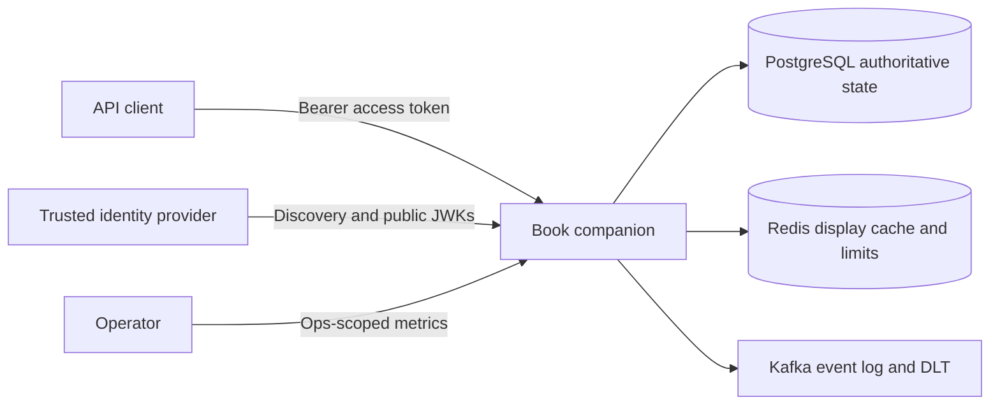
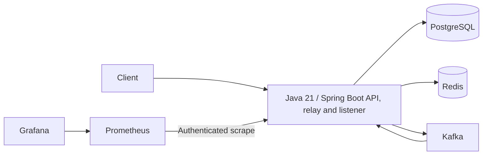
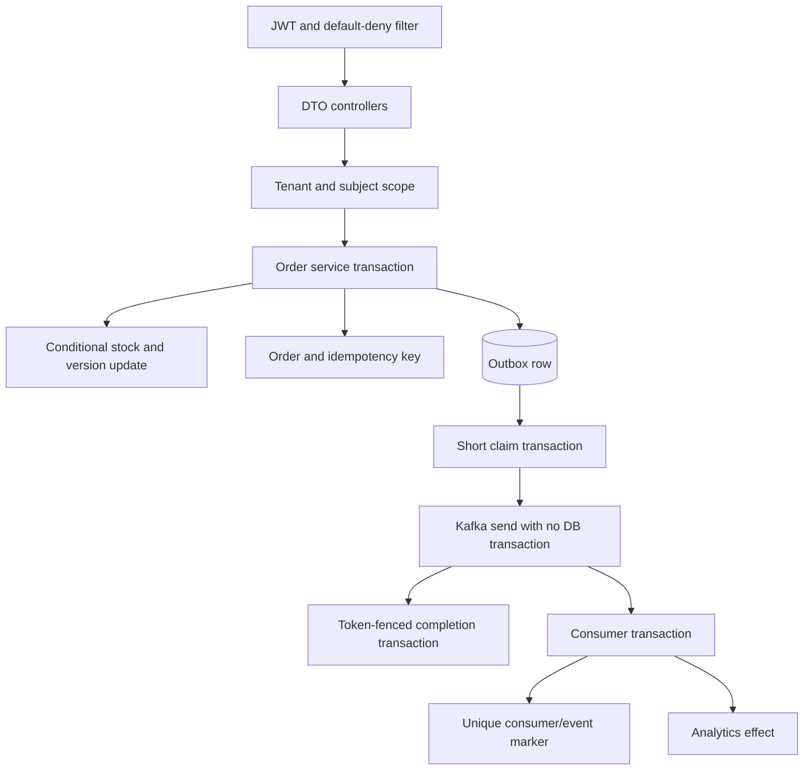

# C4-style views

## Context

```mermaid
flowchart LR
  User[API client] -->|Bearer access token| Book[Book companion]
  Issuer[Trusted identity provider] -->|Discovery and public JWKs| Book
  Operator[Operator] -->|Ops-scoped metrics| Book
  Book --> PostgreSQL[(PostgreSQL authoritative state)]
  Book --> Redis[(Redis display cache and limits)]
  Book --> Kafka[Kafka event log and DLT]
```

## Containers

```mermaid
flowchart LR
  Client --> App[Java 21 / Spring Boot API, relay and listener]
  App --> PG[(PostgreSQL)]
  App --> RD[(Redis)]
  App --> KF[Kafka]
  KF --> App
  Prom[Prometheus] -->|Authenticated scrape| App
  Graf[Grafana] --> Prom
```

## Components and transactions

```mermaid
flowchart TD
  Filter[JWT and default-deny filter] --> Web[DTO controllers]
  Web --> Scope[Tenant and subject scope]
  Scope --> Orders[Order service transaction]
  Orders --> Stock[Conditional stock and version update]
  Orders --> OrderRow[Order and idempotency key]
  Orders --> Outbox[(Outbox row)]
  Outbox --> Claim[Short claim transaction]
  Claim --> Send[Kafka send with no DB transaction]
  Send --> Finish[Token-fenced completion transaction]
  Send --> Consumer[Consumer transaction]
  Consumer --> Marker[Unique consumer/event marker]
  Consumer --> Effect[Analytics effect]
```
